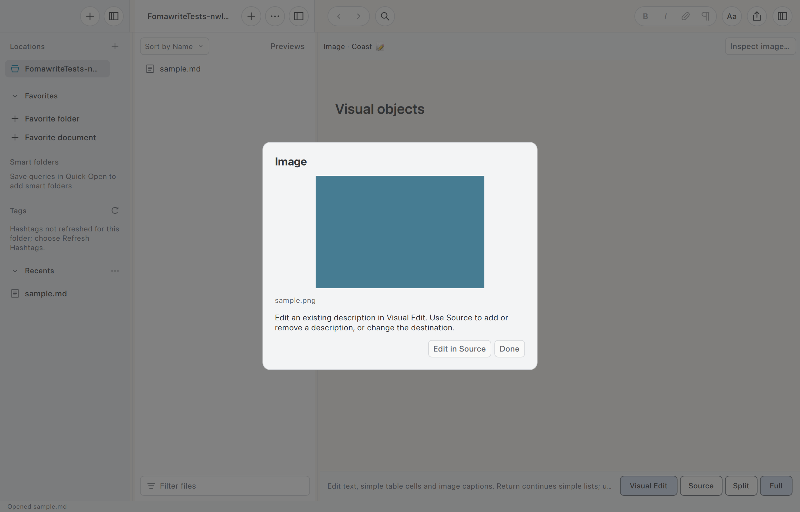

# Visual editing review

Edit **this phrase**, an *accented café*, or an emoji 📝, then try Undo.

## A local image



## A simple table

| Area | State | Note |
| :--- | :--- | ---: |
| Keyboard | Ready | F6 |
| Image | Review | Local |
| Table | Edit this cell | 3 |

## Continue a list

- First item
- Second item

1. First numbered item
2. Second numbered item

- [x] Completed task
- [ ] Next task

## Protected material

```markdown
This code stays literal, including **stars**.
```

Return at the end of a list item continues it. An empty item exits the list.
