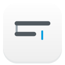
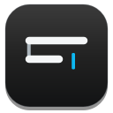

# Negative running-icon concept

A graphical test based on the approved Fomawrite icon. It retains the rounded silhouette, writing lines, short connector and blue caret. The face becomes a charcoal gradient, the lines become near-white, and the blue caret brightens slightly for contrast. A subtle upper edge and bottom shadow follow the depth in Andrew's running-cmux reference.

The first draft was too black. In Andrew's tighter cmux screenshot, clear face samples were approximately RGB 64 near the top, 45 in the middle and 25 near the bottom. The first revision matched approximately RGB 62, 44 and 25 at comparable positions. Andrew then asked for a little more top-to-bottom contrast: the current concept is approximately RGB 67, 46 and 25. The bottom stays dark charcoal while the top and middle lift slightly. Screenshot color management and the two icons' shapes prevent an exact source-asset match.

The current and negative SVGs were rendered with the project's Qt SVG renderer at 64, 128 and 256 px. The 64 px render remains legible. These files are concept artwork only: no app resource, bundle icon, runtime icon, installed app or Dock behavior was changed. A running-state switch would need separate implementation and native validation if Andrew chooses this design.

| Current | Negative concept |
| --- | --- |
|  |  |

The [previous cmux-matched render](negative-cmux-match-128.png) is saved for side-by-side review with the [current stronger-gradient render](negative-128.png).
