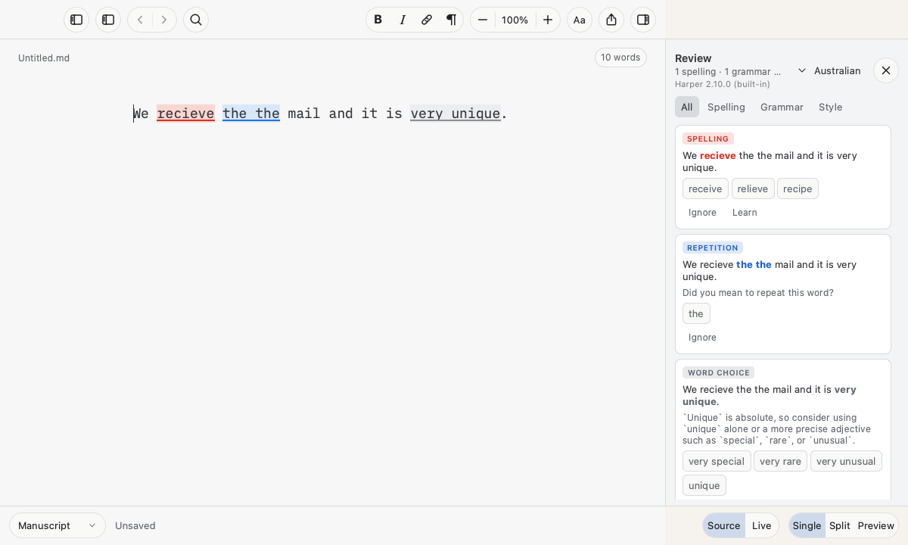
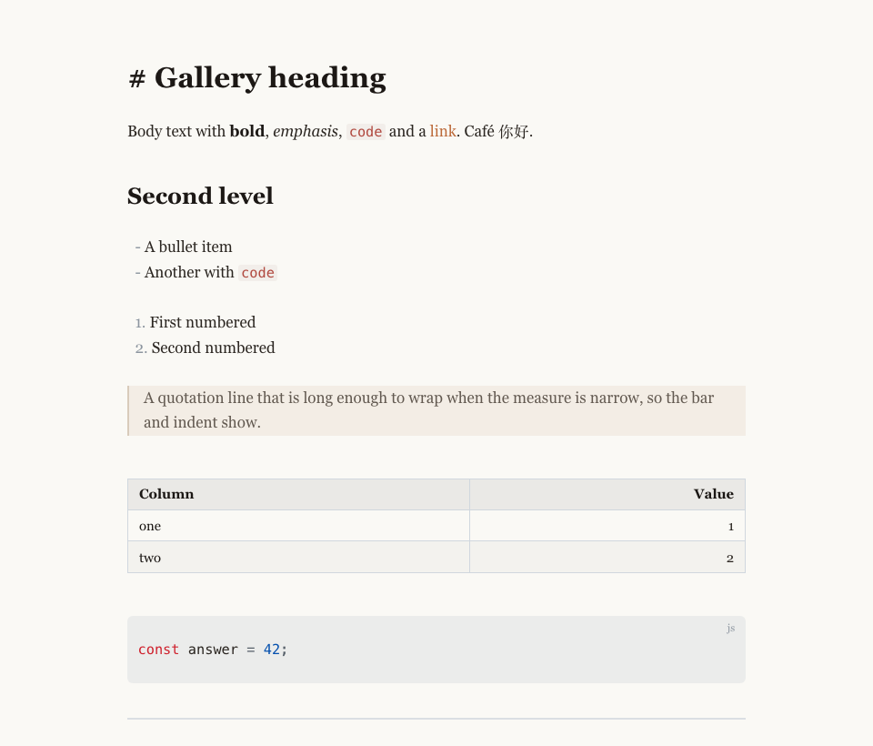
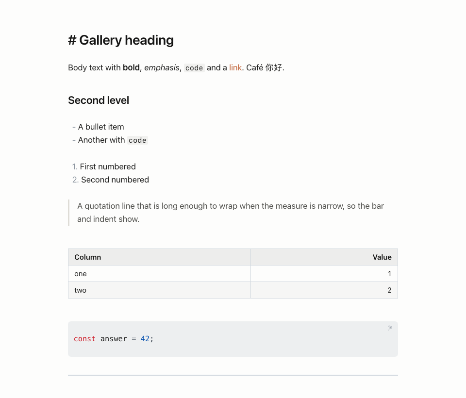

# Overnight report — night of 10 to 11 October 2026

Brief (Andrew, 10 October, 21:30): move the ball along; get Harper in; a cleaner "Claude Like" mapped to the Claude Code output page and to Ulysses; impress me in the morning.

## In one paragraph

Harper is in the installed app and is the writing engine behind Source, Live and the Review pane, with the macOS checker as the fallback, Australian as the default dialect, a Style category, and Help → Check for Writing Checker Updates… with a weekly automatic check that downloads a hash-verified newer release into the app's own folder and reloads the engine in place. Each of the two cycles was built by parallel agents from a fixed contract, merged, reviewed by a separate agent, fixed and tested; every push is green on CI. Claude Like now looks like the Claude Code output page. The Grammarly experiment is closed and its adapter removed. Build numbers, counts and the commit are in the table at the end.

## What to try (two minutes)

1. Source mode, type: `We recieve the the mail and it is very unique, their going too the shop.` Red "recieve", blue "the the" and "too"; grey "very unique" after Edit → Writing Checker → Check Style While Typing. Right-click any of them.
2. ⌘: opens the Review pane: each finding with Harper's kind (Repetition, Word Choice, Agreement…), its explanation and one-click fixes; the status line says "Harper 2.10.0 (built-in)".
3. Edit → Writing Checker → Dialect → American: "colour" goes red; Australian: it clears.
4. Help → Check for Writing Checker Updates…: a banner says up to date, or installs the newer release and reloads the engine.
5. Output Style → Claude Like.

| Claude Like before | Claude Like after |
| --- | --- |
|  |  |

## Cycle by cycle

| Cycle | What | Built by | Reviewed by | Outcome |
| --- | --- | --- | --- | --- |
| 145 spike | Harper runs inside the editor page from a pinned, sha512-verified npm release (`harper.lock.json`, `bin/fetch-harper`, a `fomawrite:` URL scheme because Chromium's fetch refuses `qrc:`) | Fable | the test: all six planted errors found in the app, Australian spellings untouched, warm lint well under a second | [record](../cycle-145/README.md) |
| 145 | Harper behind both surfaces and the pane; macOS fallback; Style; dialect and engine settings; hidden Live page created a second after launch so Source has the engine from the first keystroke | two agents (page lint service; host engine, highlighter carry, pane, menus) | reviewer agent, end to end in the real page | Ship with fixes, all taken: an engine-change signal that rebuilt the pane at the wrong moment; a renderer death silently killing Source checking (the pane now reloads); Source and Live sending Harper different text (heading markers, blanked link spans, hard-wrapped lines) so they disagreed; harper.js appends on import so unlearning never reached it; a load failure left the pane saying "loading" forever |
| 146 | Keeping Harper current: Help menu check, weekly automatic check, verified download into the data folder, versioned serving so the new module actually loads, rollback, pane status | one agent | security-first reviewer agent | see "Cycle 146 review" below |
| Theme | Claude Like reworked from the two screenshots: system sans, near-white ground, 1.6 line height, 720 px measure, hairline tables and rules, soft code panels, bar-only quotes; the serif version kept at docs/themes/claude-serif.css | Fable | gallery contrast test | done |
| Grammarly | Closed as a failed experiment; the build 142 accessibility adapter and the private-Qt dependency removed; IDEAS says No with the reason | Fable | — | done |

## Cycle 146 review

A security-first reviewer broke each check in turn and confirmed the matching test went red: the sha512 compare, the archive entry rules, the https-only rule and the version match in the scheme. It built crafted archives with symlinks and hard links and confirmed macOS's tar and the post-extraction walk refuse them; it read the real registry document and the pinned tarball to confirm the parser's shape. Verdict: ship with fixes, taken:

- A stale downloaded engine could outrank a newer one shipped with an app update; the bundled copy now wins unless the download is strictly newer.
- The check was one-shot ten seconds after launch; it now repeats every six hours while the app stays open, with the weekly rule deciding.
- Hardening: the archive may hold only the kinds of file a release holds, nothing nested, at most 64 entries (a release has 17); a trailing newline in a version string is refused; a recorded check time in the future no longer silences the check; two windows cannot install at once.

Stated plainly, as the reviewer asked: npm's integrity hash proves the download is what npm published, not who wrote it. A malicious Harper release would run inside the page's sandbox with no network, but through the editor bridge it could rewrite the open document or read the images it refers to. The weekly install is unattended and on by default. The next hardening step is to verify npm's registry signatures; it is recorded, not built. If you would rather the weekly check only notify and never install on its own, say so and it is a one-line change.

## What the reviewers caught that tests had missed

- The engine-readiness signal fired a pane rebuild between the Live page's edit and its caret update, so a half-typed word was listed. The caret path now restarts the debounce while the typing pause is open, and the signal only fires when the effective engine changes.
- Three surfaces, three different texts to Harper: the page blanks `#`, `-` and `>`, the highlighter did not, so Source and the pane showed "use title case in headings" and "two spaces" rows that Live never did. Now they agree on the probe document.
- A renderer crash of the hidden page would have left Source without marks for the rest of the session, with the engine still reporting ready.

## Honest costs and open items

- **Memory.** The hidden Live page with Harper loaded is about 450 MB resident, and each window has its own: about 900 MB for one window, 1.6 GB for two. Levers, not yet pulled: do not warm the page when the engine setting is macOS; one engine shared across windows; unload after idle. Your call whether this is acceptable for a writing app.
- **Harper's quality on your prose** is unmeasured: I still need three documents you write regularly.
- Marks vanish for a moment when Harper becomes ready after launch (macOS marks go, Harper's arrive about three seconds in).
- The CI runner's macOS has no grammar pass, so the macOS-grammar tests skip there; the Harper tests run everywhere.
- Not built: Harper's Rules page (turn individual rules off), npm provenance checks beyond the published hash, a download progress indicator.

## Process notes

- Parallel builders from a fixed contract, then one reviewer per cycle, again paid for itself: both cycles would have shipped with seam bugs the builders could not see.
- CI had been red for a day because tests assumed this Mac; it is green now and I check it after every push.
- Nothing was launched or hand-tested in the installed app; everything is offscreen tests plus captured frames.

## Numbers

| | |
| --- | --- |
| Installed everywhere | build 146 (`0.3.0-dev42`) |
| Qt suite | 273 passed, 0 failed |
| Page suite | 321 passed |
| Last commit | d0dc016 on master, pushed; CI result recorded in the line below when it landed |
| Agents | two builders and one reviewer per cycle (145, 146), one builder for the page lint service; Fable did the spike, the theme, merges, review fixes, installs and this report |
